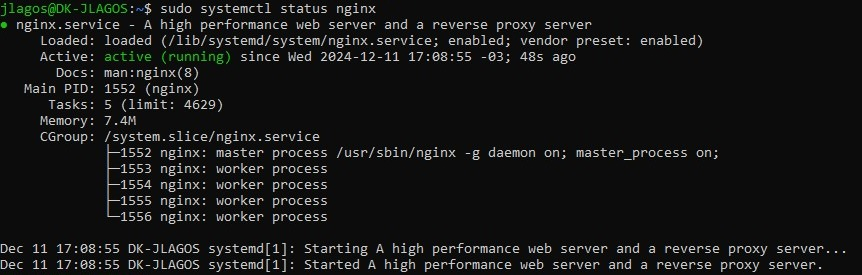
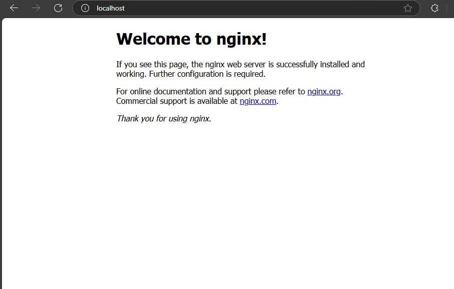
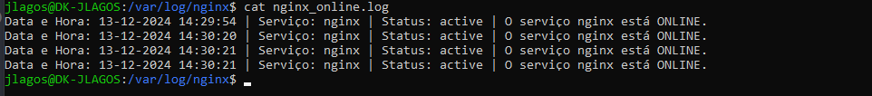

# Monitoramento Automatizado do nginx no Ubuntu 20.04 LTS

## Sobre o projeto

A prática consiste na instalação do WSL (Subsistema do Windows para Linux) no Windows e na criação de uma instância Ubuntu 20.04 LTS. Inclui também a configuração de um servidor nginx, o monitoramento do status do serviço por meio de um script personalizado e a automação da execução deste script a cada 5 minutos. O script deve conter a data, hora, o nome do serviço, o status e uma mensagem personalizada de ONLINE ou OFFLINE. O objetivo é garantir a continuidade e a disponibilidade do serviço, registrando seu status em arquivos separados.

### Índice

1. [Pré-requisitos](#1-pré-requisitos)
2. [Ativação e configuração do WSL](#2-ativação-e-configuração-do-wsl)
3. [Instalação e Configuração do Ubuntu 20.04 LTS](#3-instalação-e-configuração-do-ubuntu-2004-lts)
4. [Instalação e configuração do nginx no Ubuntu](#4-instalação-e-configuração-do-nginx-no-ubuntu)
5. [Criação do script de monitoramento do status do nginx](#5-criação-do-script-de-monitoramento-do-status-do-nginx)
6. [Automatização da execução do script](#6-automatização-da-execução-do-script)

## 1. Pré-requisitos

- Windows 10 versão 2004 e superior ou Windows 11
- Ativação do WSL
- Ubuntu 20.04 LTS instalado no WSL
- Conhecimeto básico do terminal Linux

## 2. Ativação e configuração do WSL

Clique com o botão direito do mouse sobre o PowerShell ou o Prompt de Comando do Windows e selecione **"Executar como administrador"**.

Depois, execute o comando:

```powershell
wsl --install
```

Após executado o comando e terminado a instalação do WSL, reinicie o computador.

## 3. Instalação e Configuração do Ubuntu 20.04 LTS

Abra o PowerShell como administrador e execute o comando:

```powershell
wsl --install -d Ubuntu-20.04
```

Alternativamente, você pode abrir a Microsoft Store, buscar por "Ubuntu 20.04 LTS", clicar em adquirir e instalar a distribuição.

Terminado o processo de instalação do Ubuntu no WSL, você será solicitado a criar um nome de usuário e senha. Esta conta será o **usuário padrão e administrador da distribuição**, com permissões para executar comandos de super usuário (`sudo`).

## 4. Instalação e configuração do nginx no Ubuntu

Abra o terminal do Ubuntu e execute o seguinte comando para garantir a instalação do pacote correto e sua versão mais recente:

```bash
sudo apt update
```

Após isso, instale o nginx:

```bash
sudo apt install nginx
```

Inicie e verifique o status do nginx:

```bash
sudo systemctl start nginx
```

```bash
sudo systemctl status nginx
```

Caso o nginx esteja rodando corretamente, o comando retornará uma saída como esta:



Você pode verificar se o nginx está funcional acessando a página padrão pelo navegador, por meio do IP ou digitando "localhost" na barra de endereços:



## 5. Criação do script de monitoramento do status do nginx

Antes de criar o script, é necessário que você tenha as permissões corretas para acessar e criar os arquivos de log no diretório `/var/log/nginx`. Para garantir que você tem as permissões corretas, execute o seguinte comando:

```bash
ls -ld /var/log/nginx
```

Verifique qual grupo está associado ao diretório e se ele tem permissão de escrita. Caso contrário, ajuste com o comando:

```bash
sudo chmod g+w /var/log/nginx
```

Em seguida, adicione o seu usuário ao grupo específico. Substitua grupo pelo nome do grupo listado no comando `ls -ld /var/log/nginx`e seu_usuario pelo seu nome de usuário.:

```bash
sudo usermod -aG grupo seu_usuario
```

Após isso, crie um diretório dentro do seu diretório pessoal onde o script será armazenado:

```bash
mkdir ~/scripts
```

E então utilize um editor de texto para criar e editar o script. Utilizando o `nano`:

```bash
nano ~/scripts/status_nginx.sh
```

Digite o script:

```bash
#!/bin/bash

# obtém a data e hora atuais
data_hora=$(date "+%d-%m-%Y %H:%M:%S")

# nome do serviço
servico="nginx"

# caminho para o arquivo de log online
log_online="/var/log/nginx/nginx_online.log"

# caminho para o arquivo de log offline
log_offline="/var/log/nginx/nginx_offline.log"

# verifica se os arquivos de log existem. se não, cria os arquivos
if [ ! -f "$log_online" ]; then
        touch "$log_online"
fi

if  [ ! -f "$log_offline" ]; then
        touch "$log_offline"
fi

# verifica o status do serviço nginx e escreve nos arquivos de log
status=$(systemctl is-active $servico)

if [ "$status" = "active" ]; then
        echo "Data e Hora: $data_hora | Serviço: $servico | Status: $status | O serviço $servico está ONLINE." >> "$log_online"
else
        echo "Data e Hora: $data_hora | Serviço: $servico | Status: $status | O serviço $servico está OFFLINE" >> "$log_offline"
fi
```

Pressione `CTRL + O` e `ENTER` para salvar e `CTRL + X` para sair.

Para verificar se o script está funcionando corretamente, execute o script manualmente dentro do seu diretório pessoal:

```bash
./status_nginx.sh
```

E verifique os arquivos de log correspondentes. Exemplo do arquivo de log `nginx_online.log` com os logs do serviço ativos:



## 6. Automatização da execução do script

## Referências

- [Documentação do WSL](https://docs.microsoft.com/en-us/windows/wsl/)
- [Documentação do nginx](https://nginx.org/en/docs/)
